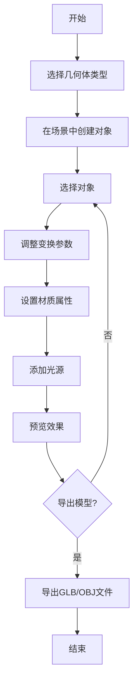

## 1. 产品概述

WebModeler 是一款基于浏览器的专业3D建模工具，支持创建、编辑和渲染3D模型。用户可以通过直观的界面创建几何体、调整材质、设置光照，并实时预览渲染效果。

- **主要用途**：为设计师、开发者和3D爱好者提供便捷的网页端3D建模体验
- **目标用户**：UI/UX设计师、游戏开发者、建筑设计师、3D艺术家
- **市场价值**：无需安装大型软件，随时随地进行3D创作

## 2. 核心功能

### 2.1 用户角色
| 角色 | 核心权限 |
|------|----------|
| 普通用户 | 创建模型、编辑材质、调整光照、导出模型 |

### 2.2 功能模块
1. **工具栏**：几何体创建、变换操作、视图控制
2. **属性面板**：对象属性、材质设置、变换参数
3. **3D视图区**：实时渲染场景、相机控制、选择交互
4. **场景树**：层级管理、对象列表、分组操作
5. **渲染设置**：环境光、点光源、聚光灯、背景设置

### 2.3 页面详情
| 页面名称 | 模块名称 | 功能描述 |
|----------|----------|----------|
| 主页面 | 工具栏 | 创建几何体（立方体、球体、圆柱体、圆锥体），变换工具（移动、旋转、缩放），视图控制（平移、旋转视角、缩放） |
| 主页面 | 属性面板 | 对象属性（名称、可见性），变换参数（位置、旋转、缩放），材质设置（颜色、金属度、粗糙度） |
| 主页面 | 3D视图区 | WebGL实时渲染，鼠标交互选择，拖拽变换，相机轨道控制 |
| 主页面 | 场景树 | 显示场景层级结构，展开/折叠节点，双击选中对象，删除对象 |
| 主页面 | 渲染设置 | 环境光照强度，添加/删除光源，调整光源位置和颜色，背景颜色/纹理设置 |

## 3. 核心流程

用户创建3D模型的主要流程：

1. 点击工具栏创建几何体
2. 在3D视图区选择对象
3. 在属性面板调整变换参数和材质
4. 添加光源和调整渲染设置
5. 导出模型文件

## 4. 用户界面设计

### 4.1 设计风格
- **主色调**：深蓝色系（#0f172a）搭配科技感青色（#06b6d4）
- **按钮风格**：圆角扁平，悬停发光效果
- **字体**：SF Pro Display / Inter，现代无衬线字体
- **布局**：三栏式布局（工具栏+视图区+属性面板）
- **图标**：线性科技风格图标

### 4.2 页面设计概览
| 页面名称 | 模块名称 | UI元素 |
|----------|----------|--------|
| 主页面 | 工具栏 | 工具栏顶部横向排列，图标按钮，分组显示，悬停提示 |
| 主页面 | 属性面板 | 右侧面板，折叠式分组，滑块和输入框，颜色选择器 |
| 主页面 | 3D视图区 | 中央大画布，网格背景，轴指示器，FPS显示 |
| 主页面 | 场景树 | 左侧可折叠面板，树状结构，复选框控制可见性 |
| 主页面 | 渲染设置 | 底部面板，光源列表，环境设置，背景选择 |

### 4.3 响应式设计
- **桌面端**：完整三栏布局，工具栏在顶部
- **平板端**：工具栏折叠为图标，属性面板可收起
- **移动端**：简化工具栏，使用底部导航

### 4.4 3D场景指导
- **环境**：中性灰色背景，渐变天空盒
- **光照**：主光源+补光+环境光的三点照明
- **相机**：透视投影，轨道控制，默认距离适中
- **交互**：左键旋转视角，右键平移，滚轮缩放
- **后处理**：抗锯齿，柔和阴影