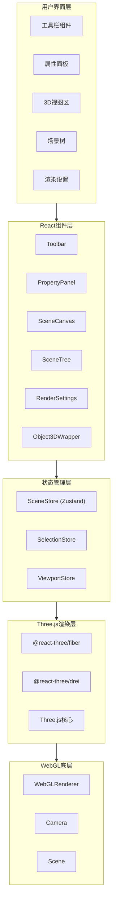
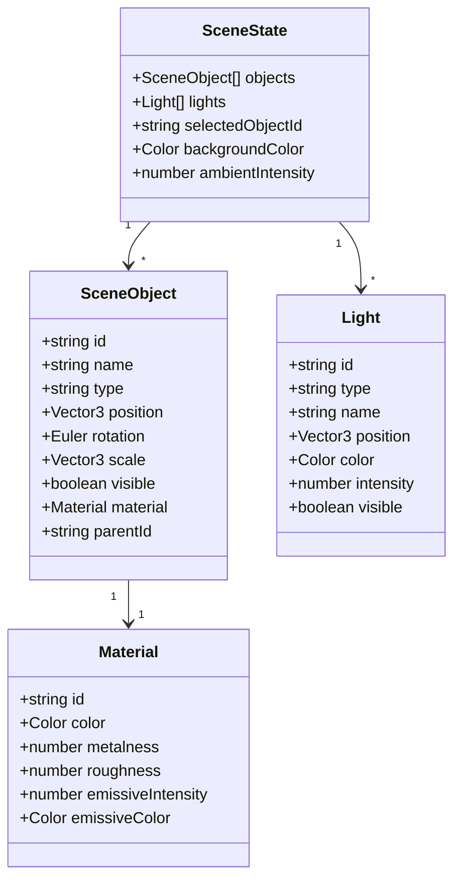

## 1. 架构设计



## 2. 技术描述

- **前端框架**：React 18 + TypeScript
- **构建工具**：Vite 6
- **CSS框架**：Tailwind CSS 3
- **3D引擎**：Three.js + @react-three/fiber + @react-three/drei
- **状态管理**：Zustand
- **图标库**：Lucide React
- **模型导出**：@react-three/rapier（物理引擎，可选）

## 3. 路由定义

| 路由 | 用途 |
|------|------|
| / | 主页面，包含完整的3D建模界面 |

## 4. 数据模型

### 4.1 对象模型定义



### 4.2 TypeScript类型定义

```typescript
interface Vector3 {
  x: number;
  y: number;
  z: number;
}

interface Euler {
  x: number;
  y: number;
  z: number;
}

interface Color {
  r: number;
  g: number;
  b: number;
}

interface Material {
  id: string;
  color: Color;
  metalness: number;
  roughness: number;
  emissiveIntensity: number;
  emissiveColor: Color;
}

interface SceneObject {
  id: string;
  name: string;
  type: 'box' | 'sphere' | 'cylinder' | 'cone' | 'torus' | 'plane';
  position: Vector3;
  rotation: Euler;
  scale: Vector3;
  visible: boolean;
  material: Material;
  parentId?: string;
}

interface Light {
  id: string;
  type: 'ambient' | 'point' | 'directional' | 'spot';
  name: string;
  position: Vector3;
  color: Color;
  intensity: number;
  visible: boolean;
}

interface SceneState {
  objects: SceneObject[];
  lights: Light[];
  selectedObjectId: string | null;
  backgroundColor: Color;
  ambientIntensity: number;
}
```

## 5. 组件结构

```
src/
├── components/
│   ├── Toolbar/
│   │   ├── Toolbar.tsx
│   │   ├── GeometryTools.tsx
│   │   ├── TransformTools.tsx
│   │   └── ViewTools.tsx
│   ├── PropertyPanel/
│   │   ├── PropertyPanel.tsx
│   │   ├── TransformPanel.tsx
│   │   ├── MaterialPanel.tsx
│   │   └── ObjectPanel.tsx
│   ├── SceneTree/
│   │   └── SceneTree.tsx
│   ├── RenderSettings/
│   │   └── RenderSettings.tsx
│   ├── SceneCanvas/
│   │   ├── SceneCanvas.tsx
│   │   ├── Object3DWrapper.tsx
│   │   ├── GridHelper.tsx
│   │   └── AxesHelper.tsx
│   └── common/
│       ├── Slider.tsx
│       ├── ColorPicker.tsx
│       ├── InputNumber.tsx
│       └── Toggle.tsx
├── stores/
│   ├── sceneStore.ts
│   ├── selectionStore.ts
│   └── viewportStore.ts
├── hooks/
│   ├── useScene.ts
│   ├── useSelection.ts
│   └── useViewport.ts
├── utils/
│   ├── geometryFactory.ts
│   ├── materialFactory.ts
│   └── exporter.ts
├── App.tsx
├── main.tsx
└── index.css
```

## 6. 核心功能实现

### 6.1 几何体创建
- 通过 `geometryFactory` 创建不同类型的几何体
- 使用 Three.js 内置几何体：BoxGeometry, SphereGeometry, CylinderGeometry 等

### 6.2 变换操作
- 位置、旋转、缩放参数调整
- 通过状态管理同步到3D对象

### 6.3 材质系统
- 支持金属度、粗糙度调节
- 支持发光材质
- 实时更新材质属性

### 6.4 光照系统
- 环境光、点光源、方向光、聚光灯
- 可调节位置、颜色、强度

### 6.5 模型导出
- 支持 GLB/GLTF 格式导出
- 使用 Three.js 的 GLTFExporter